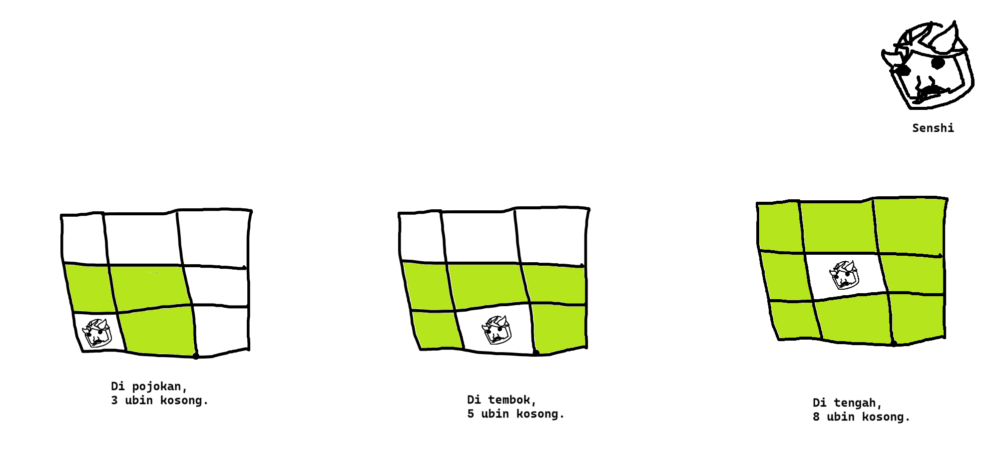
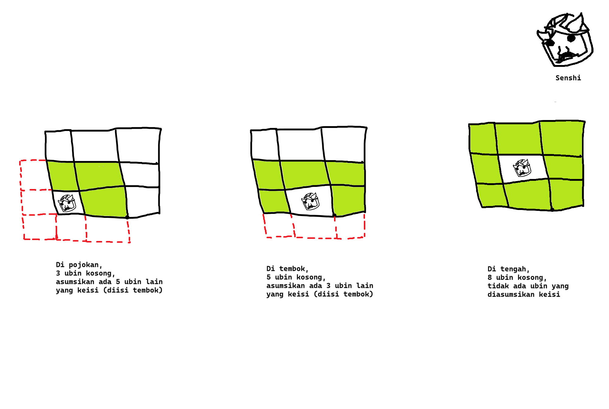

# **Editorial Senshi Lapar** 😋

**Probset:** Faiz M Kautsar  
**Difficulty:** ~~nguli~~ Easy-Medium  
**Problem statement bisa dilihat di:** [./Senshi Lapar.pdf](./Senshi%20Lapar.pdf)  
**Constraints:**

```
1 < X ≤ 9999
1 < Y ≤ 9999
0 ≤ x < X
0 ≤ y < Y
0 ≤ M ≤ 8
0 ≤ mx < X
0 ≤ my < Y
```

## 🗿 **Konsep?**

Untuk menyelesaikan masalah ini, sebenarnya secara konsep gampang, ini agak nguli di implementasi aja buat temen-temen yang belom ngerti loop dan list. Pertama-tama, problem statement harus kita breakdown jadi konseptualnya dulu, kasus-kasus apa yang bisa terjadi buat Senshi.

Ga perlu ribet-ribet mikirin koordinat monster dulu, kita pikirin aja kondisi-kondisi yang mungkin dengan input limitednya, jadi misalnya kita ambil si **X, Y, x, y dan M** ajah:

- **X:** Ukuran ruangan horizontal
- **Y:** Ukuran ruangan vertikal
- **x:** Posisi senshi secara horizontal (dari 0 sampai X-1)
- **y:** Posisi senshi secara vertikal (dari 0 sampai Y-1)
- **M:** Jumlah monster

Coba kita asumsikan bahwa semua monster M itu bakalan selalu di sekeliling Senshi (Soalnya kalo ngga... ya pasti Senshi bisa keluar kan).

Jika semua monster akan selalu ada di sekeliling Senshi, maka hanya terdapat tiga kasus yang mungkin tentang jumlah ubin yang tersedia di sekeliling Senshi:  
  
(Mmf gambarnya jelek, sedang malaz menggambar saya)

Artinya, pertama-tama kita harus menentukan posisi si Senshi di ruangan. Ini bisa kita pake jabarin semua-semuanya, atau bisa kita pake interval aja. Interval gimana? Bisa gini:

1. **Tengah:** $0 < x < X-1$ dan $0 < y < Y-1$  
   Apa maksudnya? Di sini di tengah itu pokoknya ngga di 0, **_dan_** ngga di X-1 dan Y-1. Ini karena X-1 itu koordinat tembok kanan, Y-1 itu koordinat tembok atas.  
2. **Tembok:** $0 < x < X-1$ atau $0 < y < Y-1$  
   Nah, yang ini itu karena ngga _dan_ lagi, tapi **_atau_**.  
   Jadi salah satunya, x atau y, itu _pasti_ ada di 0 atau di X-1 atau di Y-1.
3. **Pojok:** Selain yang di atas. (_else_)  
   Udah deh, kan udah di-handle yang tembok dan tengah, berarti sisanya kondisi di pojokan.

Kalo ada di tengah, cek M apakah kurang dari 8, kalau di tembok, cek kurang dari 5, terus selain itu, cek kurang dari 3. Kalo M=0, ga makan dia.

Dah jadi dong?? Belom, tapi untuk yang kasus limited ini dah selesaii, jadi kurleb gini:

```python
X, Y = map(int, input().strip().split())
x, y = map(int, input().strip().split())
M = int(input().strip()[0])

nope = False

if M < 1:
    print("Senshi makannya besok aja deh.")
else:
    if 0 < x < X - 1 and 0 < y < Y - 1:
        nope = M < 8
    elif 0 < x < X - 1 or 0 < y < Y - 1:
        nope = M < 5
    else:
        nope = M < 3

if nope:
    print("Senshi makan hari ini!")
else:
    print("Senshi makannya besok aja deh.")
```

## 🤤 **Makan Ngga?**

Nah, kan berarti dah jadi nih, logika gimana nentuin bisa ngga makan. Tinggal kita cek apakah mereka itu monsternya beneran ada di sekeliling Senshi apa ngga.

Untuk melakukan ini, ada dua cara pemikiran, **nguli** dan **ngga nguli.** 😁  


---

### 🫠 **Hari-hari nguli**

Pertama-tama, karena teman-teman "belom" ~~belom terlalu paham~~ belajar list dan loop ~~walaupun saya lihat kemarin udah nyoba pada pakek loop ama list, ama dict, ama set, dsb., bjirlah~~, kujelasin pemikiran pertama dulu, si nguli.

Nguli ini sebenernya juga simpel sih, dan agak kayak ada "seni"-nya gitu (💀). Tapi oke, kita mundur dikit dulu dan kembali ke breakdown. Pertama kita ambil dulu kan jumlah monster, terus kita terima tiap-tiap posisinya monster, kita taruh di variabel-variabel.

Karena maksimal adalah 8 monster, maka yang perlu kita pikirin adalah berapa variabel yang kita asumsikan terisi (i.e., karena kan ada tembok, gitu).

Gimana? Coba kugambarin deh (sekali lagi saya mmf gambar jelek lmao):  
  
Nah, berarti ini sebenernya kita bisa aja terima 8 variabel, tinggal tandain yang asumsi terisi.

"Eh, wait, gimana cara inputnya ini mas?" Gini, jadi untuk nguli kita bisa handle jumlah inputan untuk tiap jumlah monster. Tinggal cek, apakah M $\geq$ posisi ubin. Di sini sih sebenernya maksudnya nguli, karena kita harus handle tiap kemungkinan. 💀

Maksut? Begini:

```python
n1 = False
n2 = False
n3 = False
n4 = False
n5 = False
n6 = False
n7 = False
n8 = False

if M >= 1:
    nx, ny = map(int, input().strip().split())
    n1 = (nx, ny)
if M >= 2:
    nx, ny = map(int, input().strip().split())
    n2 = (nx, ny)
# Dan seterusnya...
```

Dengan $n_\text{angka}$ maksudnya satu buah ubin di deket Senshi.

Terus, kita cek deh buat si asumsi keisi, kan dia tergantung posisi ya, berarti bisa gini:

```python
if 0 < x < X - 1 and 0 < y < Y - 1:
    # Handle input n1, n2, n3, n4, n5, n6, n7, n8...
elif 0 < x < X - 1 or 0 < y < Y - 1:
    # Handle input n1, n2, n3, n4, n5...
    n6, n7, n8 = True, True, True
else:
    # Handle input n1, n2, n3...
    n4, n5, n6, n7, n8 = True, True, True, True, True
```

Wokee, input sama asumsi dah jadi nihh, tinggal cek posisinya di sekitar Senshi aja dah. Gimana caranya?

Di sini ada juga pemikiran nguli dan tidak nguli, tetapi karena aku niatnya pokoknya bisa kalian kerjain logicnya tanpa bahkan pake fungsi-fungsi builtin segala, bisa kita jabarin gini:

```python
    (mx != x or my != y)
    and (mx == x - 1 or mx == x + 1 or mx == x)
    and (my == y - 1 or my == y + 1 or my == y)
```

Wadaw, gimana tuh bacanya?? Kita breakdown lagi:

1. `(mx != x or my != y)`: Ga boleh keduanya mx dan my di x dan y. Ini menjamin bahwa si monster ga di posisi Senshi, karena ya... monster gak akan di Senshi karena dah ditempatin Senshi.
2. `(mx == x - 1 or mx == x + 1 or mx == x)`: Jadi si posisi x bisa ada di sebelah Senshi atau di x yang sama dengan Senshi.
3. `(my == y - 1 or my == y + 1 or my == y)`: Sama, si y bisa ada di atas atau bawah Senshi, atau di y yang sama dengan Senshi.

Nahhh, udah deh, jadinya kita tadi yang handle inputannya tinggal kita ganti pake kondisi di atas, misal:

```python
n1 = False
n2 = False
n3 = False
n4 = False
n5 = False
n6 = False
n7 = False
n8 = False

if M >= 1:
    nx, ny = map(int, input().strip().split())
    n1 = ((nx != x or ny != y)
        and (nx == x - 1 or nx == x + 1 or nx == x)
        and (ny == y - 1 or ny == y + 1 or ny == y))
if M >= 2:
    nx, ny = map(int, input().strip().split())
    n2 = ((nx != x or ny != y)
        and (nx == x - 1 or nx == x + 1 or nx == x)
        and (ny == y - 1 or ny == y + 1 or ny == y))
# Dan seterusnya...
```

Nah terakhir, kalo ga ada monster, ga makan dia. Terus, kita cek, apakah semua n1-n8 itu sekitar senshi, kalo iya dia ga makan. Selain itu, berarti Senshi makan:

```python
if M < 1:
    print("Senshi makannya besok aja deh.")
elif not (n1 and n2 and n3 and n4 and n5 and n6 and n7 and n8):
    print("Senshi makan hari ini!")
else:
    print("Senshi makannya besok aja deh.")
```

Udah dehhh 🥳🥳🎉

Bisa kalian lihat hasilnya itu di [**./main.py**](./main.py)

---

### 😎 **Nguli capek**

Okay, udah nih, ngulinya. Tapi gimana kalo kita ngga mau nguli mas?

Nah, aku sebenernya bikin ini itu ngga ada masalah kalau kalian ngerjainnya pakek loop, list, set, dict, apalah, asal ngerti udah konsepnya yang dipakek. Jadi buat additional materi aja, kujelasin singkat yang diattach di [**./main2.py**](./main2.py).

Si input itu, bisa kita jadikan input satu baris, dengan cara _list comprehension_. Apa tuh? List comprehension simpelnya sih kayak map, tapi kita definisikan dengan cara for loop, bentuknya gini:

```python
monsters = [list(map(int, input().strip().split())) for m in range(M)]
```

Jadi, M kita jadikan range (range itu jadinya kayak list berisi `0,1,2,3...M`), lalu kita for loop dalam range tersebut, kemudian kita terima input. Input itu kita strip, split, lalu kita map ke integer. Abis itu, objek mapnya kita balikin ke bentuk list.

Hasilnya? Sebuah list isinya list-list dengan koordinat-koordinat tiap monster. E.g.,

```python
[
    [1,2],
    [3,4],
    [5,6],
    # dan seterusnya...
]
```

Terus, untuk ngecek posisi semua monster, kita bisa pakai inbuilt function `all`. `all` ini cara kerjanya sama aja kayak list comprehension, tapi dia itu returnnya adalah boolean tentang apakah semua hasil comprehensionnya itu `True`.

Nah, jadi yang bisa kita lakukan itu cek apakah semua monster ada di posisi sebelah Senshi, pake kondisi yang dijabarin di atas, terus cek jumlah monster, udah deh.

```python
    all(
        (mx != x or my != y)
        and (mx == x - 1 or mx == x + 1 or mx == x)
        and (my == y - 1 or my == y + 1 or my == y)
        for mx, my in monsters
    )
    and len(monsters) >= jumlah
```

Ada contoh lagi di [**./main3.py**](./main3.py) yang lebih banyak pake loop. Tapi sebenernya ngerjain beginian itu ada "seninya" gitu kalaw tidaks nguli, jadi kalo kalian mau liat contoh yang lebih pendek lagi, aku bikinin yang kupendekin lagi logikanya di [**./main4.py**](./main4.py).
