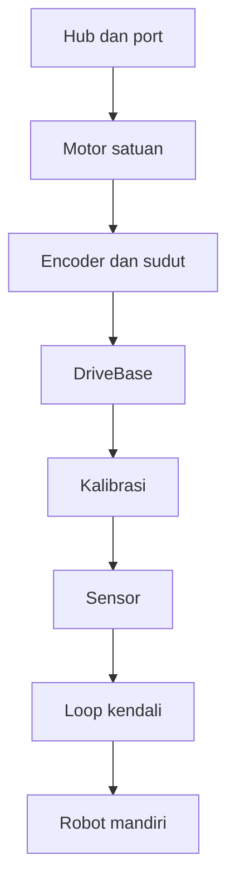
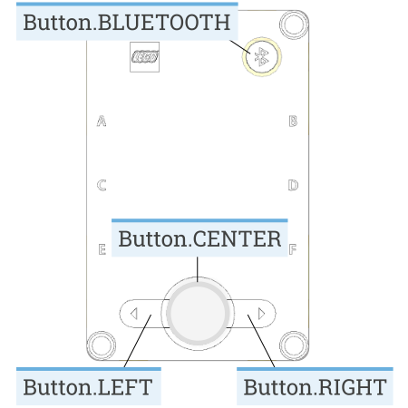
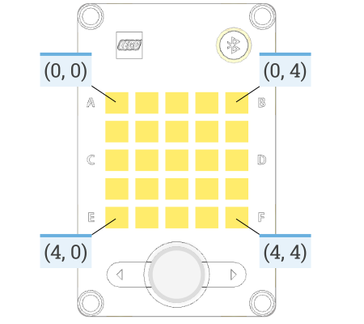
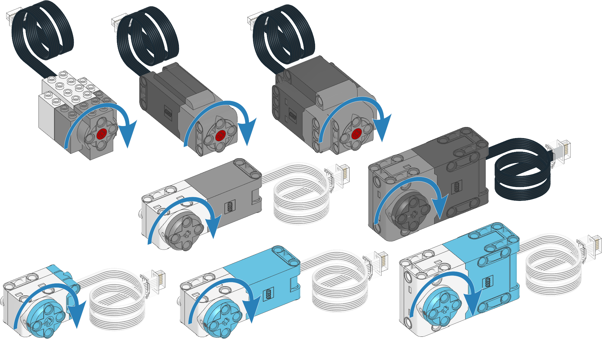
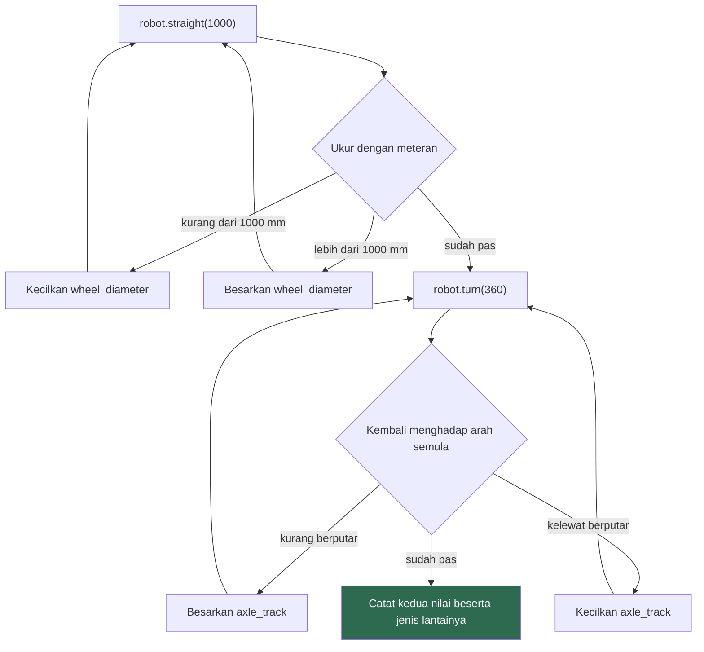
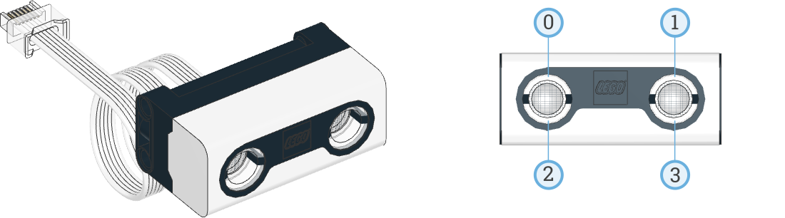
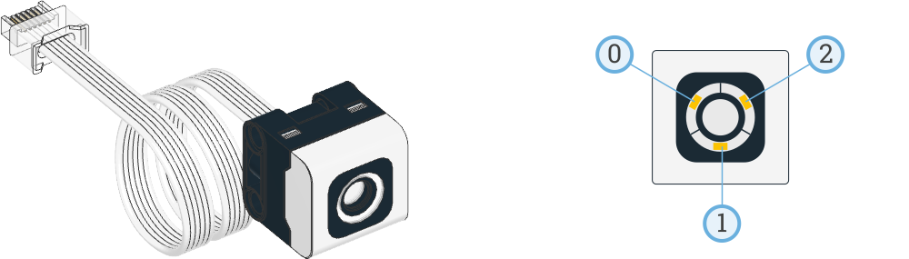
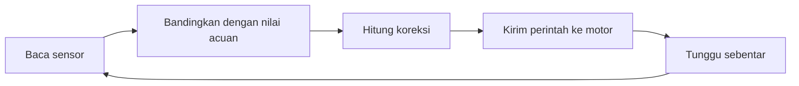
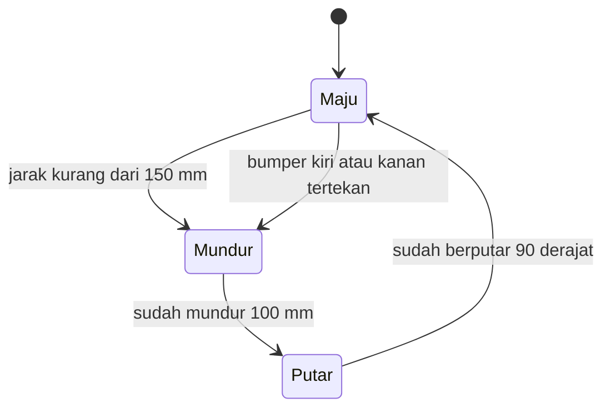

# Dasar Pemrograman Robot dengan Pybricks

Dokumen ini mengajarkan cara memprogram robot LEGO MINDSTORMS Robot Inventor memakai Pybricks dan Python.

Selesaikan `instalasi-pybricks.md` dulu. Semua kode di sini dijalankan lewat `code.pybricks.com` ke hub yang sudah terpasang firmware Pybricks.

Materi ini berdiri sendiri, terpisah dari ROS 2 dan Gazebo.

## Peta materi



## 1. Yang berubah setelah firmware diganti

Sebelum Pybricks, hub cuma menjalankan apa yang dikirim aplikasi LEGO. Sesudah Pybricks, hub menjalankan Python.

Bedanya bukan soal bahasa saja. Program kalian benar-benar berjalan di dalam hub, di prosesor kecil yang menempel pada robot. Laptop cuma dipakai untuk menulis dan mengirim kode. Setelah terkirim, laptop boleh ditutup.

Ini menjelaskan beberapa hal yang akan kalian temui nanti. Kesalahan Python muncul di panel output karena hub yang mengirimkannya balik. Program berhenti saat baris terakhir selesai, dan saat itu motor ikut berhenti. Memori hub terbatas, jadi program yang terlalu besar akan ditolak.

## 2. Anatomi hub


| Bagian                | Jumlah                | Keterangan                               |
| --------------------- | --------------------- | ---------------------------------------- |
| Port motor dan sensor | 6, dari A sampai F    | Bebas dipakai untuk motor maupun sensor  |
| Layar                 | 25 lampu, susunan 5x5 | Untuk menampilkan angka, huruf, dan ikon |
| Tombol                | 4                     | Kiri, kanan, tengah, dan Bluetooth       |
| IMU                   | 1                     | Mengukur kemiringan dan putaran          |
| Speaker               | 1                     | Nada dan bunyi                           |
| Baterai               | Terpasang di dalam    | Diisi lewat microUSB                     |

Perhatikan urutan hurufnya. Port A, C, dan E ada di satu sisi, sementara B, D, dan F ada di sisi seberangnya. Huruf-huruf itu berselang-seling, tidak berurutan mengelilingi hub, dan ini sumber kesalahan yang sering terjadi saat mencolok motor kiri dan kanan.

Tidak ada port yang khusus motor atau khusus sensor. Pybricks mengenali sendiri perangkat apa yang tercolok, dan akan memberi error kalau kalian menulis kode motor untuk port yang isinya sensor.

Tombol dan layar dilihat dari atas:





Koordinat layar dipakai kalau kalian menyalakan lampu satu per satu lewat `hub.display.pixel(baris, kolom)`. Untuk menampilkan angka dan ikon, koordinatnya tidak perlu diurus.

## 3. Struktur program

Setiap program Pybricks diawali dengan import. Yang kalian pakai sepanjang materi ini:

```python
from pybricks.hubs import InventorHub
from pybricks.pupdevices import Motor, ColorSensor, UltrasonicSensor
from pybricks.parameters import Port, Direction, Stop, Color, Button, Icon
from pybricks.robotics import DriveBase
from pybricks.tools import wait, StopWatch
```

Ambil yang perlu saja. Import yang tidak dipakai memakan memori hub.

Program paling sederhana:

```python
from pybricks.hubs import InventorHub
from pybricks.parameters import Icon
from pybricks.tools import wait

hub = InventorHub()

hub.display.icon(Icon.HEART)
hub.speaker.beep()
wait(2000)
hub.display.off()
```

Objek `hub` mewakili hub itu sendiri. Semua yang menempel di badan hub diakses lewat dia, seperti `hub.display`, `hub.speaker`, `hub.imu`, dan `hub.battery`.

## 4. Motor

Motor dibuat dengan menyebut portnya:

```python
from pybricks.pupdevices import Motor
from pybricks.parameters import Port

motor = Motor(Port.A)
```

Ada beberapa cara menyuruh motor bergerak, dan pilihannya menentukan apakah baris berikutnya menunggu atau tidak.

| Perintah                          | Satuan          | Menunggu selesai       |
| --------------------------------- | --------------- | ---------------------- |
| `motor.run(speed)`                | deg/s           | tidak, langsung lanjut |
| `motor.run_time(speed, time)`     | deg/s dan ms    | ya                     |
| `motor.run_angle(speed, angle)`   | deg/s dan deg   | ya                     |
| `motor.run_target(speed, target)` | deg/s dan deg   | ya                     |
| `motor.dc(duty)`                  | persen tegangan | tidak, langsung lanjut |

Kolom terakhir itu yang paling sering membingungkan di awal. Contoh yang menunjukkan bedanya:

```python
from pybricks.pupdevices import Motor
from pybricks.parameters import Port
from pybricks.tools import wait

motor = Motor(Port.A)

motor.run_angle(500, 360)     # berputar penuh, program menunggu di sini
print("putaran pertama selesai")

motor.run(500)                # mulai berputar, program langsung lanjut
print("baris ini muncul saat motor masih berputar")
wait(2000)
motor.stop()
```

`run_angle` berputar sejauh sudut yang diminta dihitung dari posisi sekarang. `run_target` berputar menuju sudut tertentu dihitung dari titik nol. Keduanya sering tertukar dan hasilnya berbeda jauh.

### 4.1 Cara motor berhenti

Ada tiga cara berhenti, dan pilihannya terasa jelas begitu robot kalian punya beban.

| Perintah        | Yang terjadi                                                  | Kapan dipakai                               |
| --------------- | ------------------------------------------------------------- | ------------------------------------------- |
| `motor.stop()`  | Listrik dilepas, motor berputar bebas sampai berhenti sendiri | Gerakan bebas, robot boleh meluncur sedikit |
| `motor.brake()` | Motor menahan diri secara pasif, berhenti lebih cepat         | Berhenti cepat tanpa perlu presisi          |
| `motor.hold()`  | Motor aktif menahan posisi terakhir                           | Lengan yang harus tetap terangkat           |

Kalau lengan robot kalian jatuh sendiri setelah program selesai, itu karena berhenti dengan `stop()`. Pakai `hold()`.

Perintah `run_angle` dan kawan-kawannya punya argumen `then` untuk menentukan ini:

```python
motor.run_angle(500, 90, then=Stop.HOLD)
```

Bawaannya adalah `Stop.HOLD`.

## 5. Encoder

Setiap motor punya sensor sudut di dalamnya. Motor tahu posisinya sendiri, dan kalian bisa membacanya.

```python
from pybricks.pupdevices import Motor
from pybricks.parameters import Port
from pybricks.tools import wait

motor = Motor(Port.A)
motor.reset_angle(0)

motor.run(300)
wait(3000)
motor.stop()

print("sudut sekarang:", motor.angle(), "derajat")
print("kecepatan terakhir:", motor.speed(), "deg/s")
```

Coba jalankan program ini, lalu putar poros motor dengan tangan dan jalankan lagi. Angkanya ikut berubah. Motor tidak pernah lupa posisinya selama hub menyala.

Inilah yang dipakai robot untuk memperkirakan sudah berjalan sejauh apa. Ingat kata memperkirakan, karena bagian 7 akan menunjukkan kenapa perkiraan itu meleset.

## 6. Arah dan gear

Setiap motor punya arah positif bawaan. Panah biru di gambar berikut menunjukkan ke mana poros berputar saat kalian memberi kecepatan positif:



Dua motor yang dipasang berhadapan di kiri dan kanan robot akan berputar ke arah berlawanan saat diberi perintah yang sama. Salah satunya perlu dibalik:

```python
left = Motor(Port.A, Direction.COUNTERCLOCKWISE)
right = Motor(Port.B, Direction.CLOCKWISE)
```

Kalau robot kalian berputar di tempat padahal disuruh maju, ini penyebabnya.

Untuk motor yang tersambung ke roda lewat gigi, sebutkan susunan giginya supaya perhitungan sudut tetap benar:

```python
motor = Motor(Port.A, gears=[12, 36])
```

Angka itu jumlah gigi, dari gigi yang menempel di motor sampai gigi yang menempel di roda.

## 7. DriveBase

Menggerakkan dua motor satu per satu untuk berjalan lurus itu merepotkan. `DriveBase` menangani keduanya sekaligus dan mengubah satuannya jadi milimeter dan derajat.

```python
from pybricks.pupdevices import Motor
from pybricks.parameters import Port, Direction
from pybricks.robotics import DriveBase

left = Motor(Port.A, Direction.COUNTERCLOCKWISE)
right = Motor(Port.B, Direction.CLOCKWISE)

robot = DriveBase(left, right, wheel_diameter=56, axle_track=114)

robot.straight(300)      # maju 300 mm
robot.turn(90)           # putar 90 derajat ke kanan
robot.straight(-300)     # mundur 300 mm
robot.turn(-90)          # putar 90 derajat ke kiri
```

Angka positif berarti maju dan berputar searah jarum jam dilihat dari atas. Angka negatif berarti mundur dan berlawanan arah jarum jam.

| Perintah                        | Satuan         | Keterangan                                 |
| ------------------------------- | -------------- | ------------------------------------------ |
| `robot.straight(distance)`      | mm             | Maju atau mundur, program menunggu         |
| `robot.turn(angle)`             | deg            | Berputar di tempat, program menunggu       |
| `robot.arc(radius, angle)`      | mm dan deg     | Menikung dengan radius tertentu            |
| `robot.drive(speed, turn_rate)` | mm/s dan deg/s | Jalan terus, program langsung lanjut       |
| `robot.stop()`                  |                | Berhenti                                   |
| `robot.distance()`              | mm             | Jarak tempuh menurut encoder               |
| `robot.angle()`                 | deg            | Sudut hadap menurut encoder                |
| `robot.reset()`                 |                | Kembalikan hitungan jarak dan sudut ke nol |

Dua parameter di konstruktor menentukan seberapa benar semua angka di atas.

```
        wheel_diameter
             |
          ( === )              ( === )
             |                    |
             +--------------------+
                   axle_track
```

`wheel_diameter` adalah diameter roda dalam mm. `axle_track` adalah jarak antara titik sentuh kedua roda ke lantai, bukan panjang as-nya.

Untuk roda LEGO, diameter sering tercetak di sisi ban. Tulisan `62.4 x 20` berarti diameternya 62.4 mm dan lebarnya 20 mm. Untuk mengukur `axle_track`, jarak antar lubang di balok Technic adalah 8 mm, jadi kalian bisa menghitungnya dari jumlah lubang.

## 8. Kalibrasi

Angka hasil pengukuran penggaris hampir tidak pernah langsung benar. Ban tertekan berat robot, jadi diameter efektifnya lebih kecil dari yang tercetak. As motor melengkung sedikit di bawah beban, jadi titik sentuh roda bergeser ke arah tengah robot.

Prosedurnya begini, dan urutannya penting.



Pertama, betulkan `wheel_diameter`:

```python
robot.straight(1000)
```

Ukur jarak sebenarnya dengan meteran. Kalau robot kurang jauh, kecilkan `wheel_diameter` sedikit. Kalau kelewat jauh, besarkan.

Kedua, setelah diameter benar, betulkan `axle_track`:

```python
robot.turn(360)
```

Robot harus kembali menghadap arah semula. Kalau kurang berputar, besarkan `axle_track` sedikit. Kalau kelewat berputar, kecilkan.

Selalu betulkan `wheel_diameter` lebih dulu, karena nilai itu ikut mempengaruhi hasil putaran. Setelah keduanya disetel, uji lagi jalan lurus dan berputar.

Robot yang sudah dikalibrasi di lantai keramik akan meleset lagi di karpet. Nilainya bukan sifat robot, melainkan sifat robot pada permukaan tertentu. Catat nilai kalibrasi kalian beserta jenis lantainya.

## 9. Sensor

Set 51515 berisi satu Ultrasonic Sensor dan satu Color Sensor.

### 9.1 Ultrasonic Sensor

Mengukur jarak ke benda di depannya dengan gelombang suara.



Nomor pada gambar kanan adalah urutan lampu. Satu angka menyalakan keempatnya sekaligus, `eyes.lights.on(100)`, sedangkan tuple berisi empat angka mengatur masing-masing, `eyes.lights.on((100, 0, 0, 100))`.

```python
from pybricks.pupdevices import UltrasonicSensor
from pybricks.parameters import Port
from pybricks.tools import wait

eyes = UltrasonicSensor(Port.C)

while True:
    print(eyes.distance(), "mm")
    wait(200)
```

| Perintah                     | Hasil                                               |
| ---------------------------- | --------------------------------------------------- |
| `eyes.distance()`            | Jarak dalam mm                                      |
| `eyes.presence()`            | `True` kalau ada sensor ultrasonic lain di dekatnya |
| `eyes.lights.on(brightness)` | Menyalakan empat lampu di sensor                    |

Sensor ini punya beberapa perilaku yang perlu kalian ketahui sebelum mengira kodenya salah. Permukaan yang miring memantulkan suara menjauh, jadi dinding yang menyudut sering terbaca lebih jauh dari kenyataannya atau tidak terbaca sama sekali. Kain dan busa menyerap suara. Benda yang terlalu dekat, di bawah beberapa sentimeter, juga tidak terbaca dengan benar.

Ini alasan kenapa robot yang berhenti rapi di depan dinding lurus bisa menabrak dinding yang sama saat didekati dari sudut. Bagian 9.3 menambahkan bumper untuk menangkap kasus seperti ini.

### 9.2 Color Sensor

Membaca warna dan tingkat pantulan permukaan di bawahnya.



```python
from pybricks.pupdevices import ColorSensor
from pybricks.parameters import Port, Color
from pybricks.tools import wait

sensor = ColorSensor(Port.D)

while True:
    print(sensor.color(), sensor.reflection())
    wait(200)
```

| Perintah              | Hasil                                          |
| --------------------- | ---------------------------------------------- |
| `sensor.color()`      | Salah satu nilai `Color`, misalnya `Color.RED` |
| `sensor.reflection()` | Persentase pantulan, 0 sampai 100              |
| `sensor.ambient()`    | Persentase cahaya sekitar, 0 sampai 100        |
| `sensor.hsv()`        | Nilai hue, saturation, dan value mentah        |

Untuk mengikuti garis, `reflection()` lebih berguna daripada `color()` karena hasilnya berupa angka bertingkat, bukan kategori.

Jarak sensor ke lantai sangat berpengaruh. Beda dua milimeter sudah mengubah angka pantulan. Pasang sensor sedekat mungkin ke lantai dan jangan diubah-ubah setelah kalian mengukur nilai acuan.

### 9.3 Tombol hub sebagai bumper

Rancangan StarterBot resmi memakai tombol kiri dan kanan hub sebagai bumper mekanis. Batang LEGO menempel ke tombol, dan saat robot menabrak sesuatu, batang itu menekan tombol.

```python
from pybricks.hubs import InventorHub
from pybricks.parameters import Button
from pybricks.tools import wait

hub = InventorHub()

while True:
    pressed = hub.buttons.pressed()
    if Button.LEFT in pressed:
        print("tabrakan di kiri")
    if Button.RIGHT in pressed:
        print("tabrakan di kanan")
    wait(50)
```

Ini berguna karena Ultrasonic Sensor punya sudut pandang sempit. Benda tipis seperti kaki meja sering lolos dari deteksi, dan bumper yang menangkapnya.

## 10. Waktu

```python
from pybricks.tools import wait, StopWatch

wait(1000)                    # berhenti 1000 ms

timer = StopWatch()
robot.straight(500)
print("butuh", timer.time(), "ms")
```

`StopWatch` mulai menghitung begitu dibuat. Metodenya `time()`, `pause()`, `resume()`, dan `reset()`.

## 11. Loop kendali

Sampai sini kalian menyuruh robot melakukan gerakan yang sudah ditentukan. Sekarang robot yang menentukan gerakannya sendiri berdasarkan pembacaan sensor.

Bentuknya selalu sama, apa pun sensornya:



Robot tidak pernah tahu posisinya yang sebenarnya. Yang dia tahu cuma selisih antara pembacaan sensor sekarang dan nilai yang dia inginkan, dan dia bergerak untuk mengecilkan selisih itu. Loop ini berjalan puluhan kali per detik, dan dari luar terlihat seperti robot yang paham apa yang dia lakukan.

### 11.1 Berhenti sebelum menabrak

```python
from pybricks.pupdevices import Motor, UltrasonicSensor
from pybricks.parameters import Port, Direction
from pybricks.robotics import DriveBase
from pybricks.tools import wait

left = Motor(Port.A, Direction.COUNTERCLOCKWISE)
right = Motor(Port.B, Direction.CLOCKWISE)
eyes = UltrasonicSensor(Port.C)

robot = DriveBase(left, right, wheel_diameter=56, axle_track=114)

robot.drive(150, 0)

while eyes.distance() > 200:
    wait(10)

robot.stop()
print("berhenti pada jarak", eyes.distance(), "mm")
```

Jalankan ini beberapa kali dan catat angka terakhirnya. Angkanya tidak akan sama persis, dan tidak akan tepat 200 mm. Robot butuh waktu untuk membaca sensor, dan setelah `stop()` dipanggil robot masih meluncur sedikit.

### 11.2 Mengikuti garis

Ini contoh proportional control, cara paling sederhana membuat robot mengoreksi diri sendiri.

```python
from pybricks.pupdevices import Motor, ColorSensor
from pybricks.parameters import Port, Direction
from pybricks.robotics import DriveBase
from pybricks.tools import wait

left = Motor(Port.A, Direction.COUNTERCLOCKWISE)
right = Motor(Port.B, Direction.CLOCKWISE)
sensor = ColorSensor(Port.D)

robot = DriveBase(left, right, wheel_diameter=56, axle_track=114)

BLACK = 9
WHITE = 85
threshold = (BLACK + WHITE) / 2

DRIVE_SPEED = 100
GAIN = 1.2

while True:
    deviation = sensor.reflection() - threshold
    turn_rate = GAIN * deviation
    robot.drive(DRIVE_SPEED, turn_rate)
    wait(10)
```

Robot tidak mengikuti tengah garis. Robot mengikuti tepi garis, tempat pantulan bernilai di antara hitam dan putih.

| Posisi sensor     | Pantulan     | `deviation`   | Yang dilakukan robot        |
| ----------------- | ------------ | ------------- | --------------------------- |
| Terlalu ke putih  | mendekati 85 | positif       | Membelok ke arah garis      |
| Pas di tepi garis | sekitar 47   | mendekati nol | Jalan lurus                 |
| Terlalu ke hitam  | mendekati 9  | negatif       | Membelok menjauh dari garis |

Nilai `BLACK` dan `WHITE` harus kalian ukur sendiri dengan program di 9.2, di lintasan yang akan dipakai, dengan pencahayaan ruangan saat itu. Angka 9 dan 85 di atas cuma titik awal.

`GAIN` menentukan seberapa keras robot mengoreksi. Terlalu kecil, robot memotong tikungan dan lepas dari garis. Terlalu besar, robot berkelok-kelok tajam dan bisa terlempar keluar. Naikkan sedikit demi sedikit sampai robot mengikuti garis dengan goyangan yang masih wajar, lalu berhenti di situ.

Ini bagian yang tidak bisa dihitung di atas kertas. Nilai yang benar bergantung pada berat robot, jenis ban, kecepatan, dan permukaan lintasan.

### 11.3 Mendeteksi macet

Motor tahu kalau dirinya tertahan.

```python
motor.run_until_stalled(300, duty_limit=40)
motor.reset_angle(0)
```

Ini cara umum mencari titik nol sebuah lengan atau capit. Suruh motor bergerak sampai membentur pembatas mekanis, lalu tetapkan posisi itu sebagai sudut nol. Argumen `duty_limit` membatasi tenaga supaya benturannya tidak merusak gigi.

## 12. Robot yang berdiri sendiri

Program yang sudah dijalankan sekali tersimpan di dalam hub, di slot yang sedang terpilih. Hub Robot Inventor punya lima slot.

Tombol kiri dan kanan memilih slot, nomornya muncul di layar 5x5. Tombol tengah menjalankan program di slot itu.

Tombol yang dimaksud ada di gambar bagian 2. `Button.LEFT` dan `Button.RIGHT` untuk memilih slot, `Button.CENTER` untuk menjalankan.

Untuk latihan yang berjalan tanpa laptop, beri jeda di awal supaya kalian sempat meletakkan robot:

```python
from pybricks.hubs import InventorHub
from pybricks.parameters import Icon
from pybricks.tools import wait

hub = InventorHub()

hub.display.number(3)
wait(1000)
hub.display.number(2)
wait(1000)
hub.display.number(1)
wait(1000)
hub.display.icon(Icon.HAPPY)

# gerakan robot ditulis di bawah sini
```

## 13. Yang diajarkan hardware dan tidak diajarkan simulasi

Simulasi memberi kalian dunia yang patuh. Perintah maju 300 mm menghasilkan 300 mm. Hardware tidak begitu, dan justru di situ letak pelajarannya.

| Yang terjadi       | Kenapa                                                                     | Yang kalian lihat                                                            |
| ------------------ | -------------------------------------------------------------------------- | ---------------------------------------------------------------------------- |
| Roda selip         | Gesekan ban ke lantai terbatas, terutama saat mulai jalan dan berhenti     | `robot.distance()` melaporkan jarak lebih jauh dari kenyataan                |
| Backlash pada gigi | Ada celah kecil antar gigi yang harus dilalui dulu sebelum tenaga tersalur | Gerakan bolak-balik meleset sedikit, dan melesetnya selalu ke arah yang sama |
| Baterai melemah    | Tegangan turun saat baterai berkurang, motor dapat tenaga lebih kecil      | Robot yang tadi pagi lurus sekarang belok, tanpa ada kode yang berubah       |
| Jitter waktu       | `wait(10)` tidak persis 10 ms, dan waktu baca sensor ikut berubah-ubah     | Hasil dua kali percobaan yang sama tidak identik                             |
| Sensor berisik     | Setiap pembacaan punya sedikit galat                                       | Nilai `distance()` bergoyang beberapa milimeter walau robot diam             |

Semua ini punya penanganan. Kalibrasi menutupi selip dan backlash. Loop kendali menutupi baterai yang melemah dan sensor yang berisik, karena robot mengoreksi berdasarkan apa yang terbaca, bukan berdasarkan apa yang diharapkan.

Robot yang bergantung pada `robot.straight()` saja akan gagal begitu lantainya diganti. Robot yang membaca sensor sambil berjalan tetap sampai tujuan.

## 14. Latihan

Kerjakan berurutan. Setiap nomor memakai hasil nomor sebelumnya.

| No  | Tugas                                                                                                                                                 | Yang dilatih            | Bukti                                                                                                                  |
| --- | ----------------------------------------------------------------------------------------------------------------------------------------------------- | ----------------------- | ---------------------------------------------------------------------------------------------------------------------- |
| 1   | Kalibrasi robot kalian dengan prosedur di bagian 8                                                                                                    | Kalibrasi               | Nilai `wheel_diameter` dan `axle_track` akhir, jenis lantainya, dan hasil `straight(1000)` sebelum dan sesudah disetel |
| 2   | Tempuh lintasan persegi 400 mm dan kembali ke titik awal. Jalankan lima kali                                                                          | Akumulasi galat         | Lima angka simpangan yang tercatat, beserta penjelasan kenapa kelimanya berbeda                                        |
| 3   | Jalan lurus sampai Ultrasonic Sensor membaca kurang dari 150 mm, berhenti, mundur 100 mm, putar 90 derajat, lanjut jalan. Tambahkan bumper tombol hub | Sensor dan percabangan  | Robot menghindari dinding dan juga kaki meja yang tidak terbaca sensor                                                 |
| 4   | Cari nilai `GAIN` terbaik untuk pengikut garis di 11.2 dengan mencoba                                                                                 | Loop kendali dan tuning | Tiga nilai yang diuji beserta perilaku robot pada masing-masing, dan waktu tempuh satu putaran pada nilai terbaik      |
| 5   | Simpan program nomor 4 di slot 1 dan nomor 3 di slot 2                                                                                                | Program slot            | Keduanya berjalan tanpa laptop tersambung                                                                              |

Nomor kedua adalah intinya. Kalau kelima percobaan menghasilkan simpangan yang sama persis, berarti kalian belum benar-benar mengukurnya. Robot fisik tidak mengulang gerakannya dengan sempurna, dan seluruh materi sisa semester dibangun di atas kenyataan itu.

Bentuk program nomor 3 kalau digambar:



Robot berpindah antar keadaan, dan di setiap keadaan dia mengerjakan satu hal saja. Cara menulis program seperti ini terus dipakai sampai robot yang jauh lebih rumit.

## Bacaan lanjutan

Dokumentasi API lengkap ada di `https://docs.pybricks.com`. Halaman yang paling sering kalian buka:

| Topik                                                  | Halaman resmi                                                                      |
| ------------------------------------------------------ | ---------------------------------------------------------------------------------- |
| Motor                                                  | [Motor](https://docs.pybricks.com/en/stable/pupdevices/motor.html)                 |
| DriveBase                                              | [robotics](https://docs.pybricks.com/en/stable/robotics.html)                      |
| Sensor                                                 | [pupdevices](https://docs.pybricks.com/en/stable/pupdevices/index.html)            |
| Layar, tombol, IMU, speaker, baterai                   | [Prime Hub / Inventor Hub](https://docs.pybricks.com/en/stable/hubs/primehub.html) |
| `Port`, `Direction`, `Stop`, `Color`, `Button`, `Icon` | [parameters](https://docs.pybricks.com/en/stable/parameters/index.html)            |
| `wait` dan `StopWatch`                                 | [tools](https://docs.pybricks.com/en/stable/tools/index.html)                      |
| Satuan yang dipakai setiap perintah                    | [Signals and Units](https://docs.pybricks.com/en/stable/signaltypes.html)          |

Panduan membangun robot StarterBot untuk set 51515 ada di [MINDSTORMS StarterBot](https://pybricks.com/learn/building-a-robot/mindstorms-inventor/). Rancangan itu yang dipakai di semua contoh dokumen ini, yaitu dua motor penggerak, Ultrasonic Sensor di depan, Color Sensor menghadap lantai, dan dua bumper yang menekan tombol kiri dan kanan hub.

Dokumentasi juga bisa dibuka langsung dari dalam Pybricks Code lewat ikon buku di sisi kanan, tanpa perlu meninggalkan editor.

## Catatan teknis dan atribusi

Gambar hub, tombol, layar, motor, dan sensor di dokumen ini diambil dari repositori [pybricks/pybricks-api](https://github.com/pybricks/pybricks-api), sumber dari halaman docs.pybricks.com, di bawah lisensi MIT. Filenya tersimpan di folder `media/pybricks-docs/` beserta keterangan sumber per file.

Diagram alur dan tabel dibuat sendiri untuk mata kuliah ini, karena dokumentasi resmi tidak menyediakan gambar untuk prosedur kalibrasi maupun untuk bentuk loop kendali.

Contoh kode diverifikasi terhadap dokumentasi Pybricks versi 4.0. Kalau versi firmware di hub kalian berbeda, periksa halaman resminya karena nama perintah bisa berubah antar versi besar.
