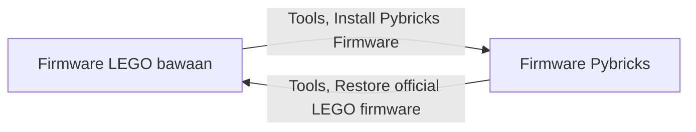
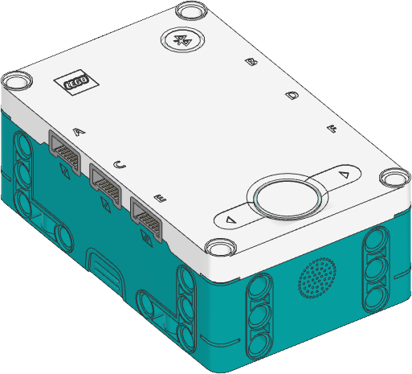
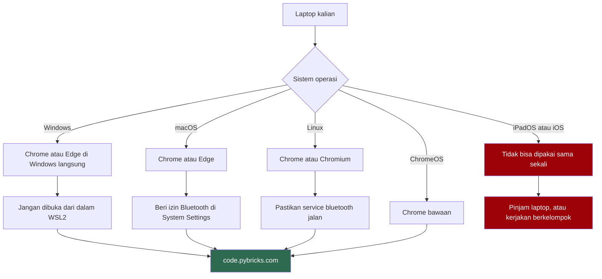
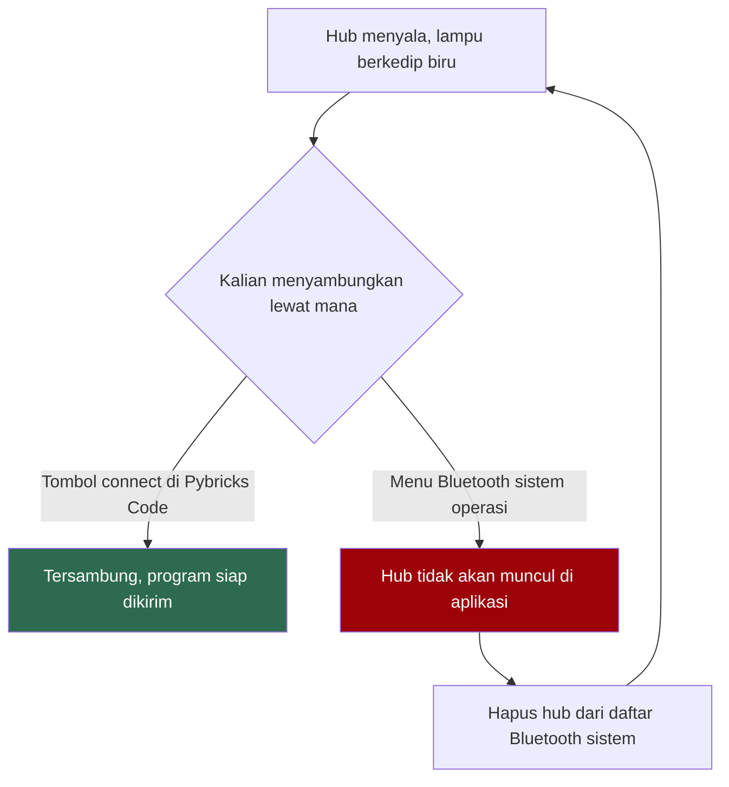

# Panduan Instalasi Pybricks untuk LEGO MINDSTORMS

Panduan ini untuk memasang Pybricks pada hub LEGO MINDSTORMS Robot Inventor (set 51515), supaya kalian bisa memprogramnya dengan Python.

Pybricks berdiri sendiri. Tidak ada hubungannya dengan ROS 2 dan Gazebo yang kalian pasang di panduan lain, dan tidak perlu menunggu keduanya selesai. Kerjakan panduan ini kapan saja.

## Apa yang sebenarnya kita pasang

Hub MINDSTORMS itu komputer kecil. Di dalamnya ada firmware, sama seperti laptop punya sistem operasi. Firmware bawaan LEGO hanya mau bekerja dengan aplikasi LEGO.

Pybricks mengganti firmware itu dengan MicroPython. Setelah diganti, hub menjalankan program Python langsung di dalam hub, dan semua motor serta sensor jadi bisa dipakai dari kode.

Proses ini bisa dibalik kapan saja. Bagian 5 berisi caranya. Kalau kalian ragu sebelum mulai, jalankan dulu prosedur pemulihan itu untuk melihat bahwa jalurnya memang ada.



Hub cuma bisa berada di salah satu keadaan, tidak pernah keduanya sekaligus.

## Bagian 1: Yang perlu disiapkan

Hub yang kita pakai bentuknya seperti ini, dengan huruf port A sampai F tercetak di badannya:



| Barang | Keterangan |
|---|---|
| Hub Robot Inventor | Kotak persegi dengan layar 5x5, ada di set 51515 |
| Kabel microUSB | Wajib untuk memasang firmware pertama kali. Kabel data, bukan kabel yang cuma bisa mengisi daya |
| Laptop dengan Bluetooth | Windows 10 atau 11, macOS, Linux, atau ChromeOS |
| Browser | Chrome, Edge, atau Chromium |

### 1.1 Browser yang bisa dan tidak bisa

Pybricks Code berjalan di atas Web Bluetooth. Tidak semua browser punya ini, dan yang tidak punya bukan karena belum sempat, melainkan karena vendornya memutuskan tidak akan membuatnya.

| Browser | Windows | macOS | Linux | ChromeOS | iPadOS dan iOS |
|---|---|---|---|---|---|
| Chrome | bisa | bisa | bisa | bisa | tidak |
| Edge | bisa | bisa | bisa | bisa | tidak |
| Chromium | bisa | bisa | bisa | bisa | tidak |
| Safari | tidak ada | tidak ada | tidak ada | tidak ada | tidak ada |
| Firefox | tidak ada | tidak ada | tidak ada | tidak ada | tidak ada |

Dokumentasi Pybricks menyebutkan dua hal ini secara eksplisit. Firefox tidak mendukung Bluetooth di platform mana pun. iPad dan iPhone tidak didukung karena Safari di iOS dan Chrome di iOS sama-sama tidak punya akses Bluetooth.

Kalau selama ini kalian memakai Safari atau Firefox, pasang Chrome khusus untuk mata kuliah ini. Tidak ada cara lain, dan tidak akan ada.

Jalur kalian, tergantung sistem operasi:



### 1.2 Pengguna Windows, jangan lewat WSL2

Di panduan ROS 2, kalian bekerja di dalam WSL2. Untuk Pybricks, jangan.

WSL2 tidak punya akses ke Bluetooth. Ini bukan soal driver yang belum dipasang. Maintainer `usbipd-win` menyatakan sendiri bahwa WSL berjalan seperti container dan layanan Bluetooth-nya memang tidak ada di sana. Orang yang berhasil menembusnya harus mengompilasi kernel WSL2 sendiri, dan itu di luar lingkup kelas ini.

Buka `code.pybricks.com` di Chrome atau Edge yang berjalan di Windows langsung. Biarkan WSL2 untuk ROS 2.

### 1.3 Pengguna macOS

Chrome perlu izin Bluetooth dari sistem. Buka System Settings, masuk ke Privacy & Security, lalu Bluetooth, dan pastikan Chrome ada di daftar dan aktif.

Kalau izin ini pernah ditolak, Chrome tidak menampilkan pesan error yang jelas. Yang terlihat cuma daftar perangkat yang kosong terus. Periksa ini sebelum menyalahkan hub.

### 1.4 Pengguna Linux

Chrome atau Chromium sudah cukup. Pastikan BlueZ terpasang dan service-nya jalan:

```bash
bluetoothctl --version
systemctl status bluetooth
```

Kalau `navigator.bluetooth` tidak dikenali di browser kalian, aktifkan flag `#experimental-web-platform-features` lewat `about://flags`, lalu restart browser.

## Bagian 2: Pasang firmware Pybricks

### 2.1 Buka aplikasinya

Buka `https://code.pybricks.com` di Chrome atau Edge.

Halaman ini terlihat seperti aplikasi biasa, padahal cuma halaman web. Di dalamnya sudah ada editor kode, tombol untuk menjalankan program, dan pengelola file.

### 2.2 Jalankan pemasangan

Buka menu Tools, lalu klik Install Pybricks Firmware. Layar akan memandu kalian lewat lima langkah:

1. Pilih tipe hub. Untuk set 51515, pilih Inventor Hub.
2. Baca dan setujui lisensi software yang dipakai firmware.
3. Beri nama hub kalian. Pakai nama yang gampang diingat dan tempelkan label fisik dengan nama yang sama di hub itu. Di lab dengan belasan hub menyala bersamaan, ini yang menyelamatkan kalian.
4. Ikuti instruksi untuk memasukkan hub ke update mode. Ada video yang menunjukkan bentuknya. Di sebagian komputer akan muncul instruksi tambahan untuk memasang driver.
5. Pilih perangkat di popup yang muncul, lalu tunggu progress bar selesai.

Langkah 4 dan 5 memerlukan kabel microUSB. Pemasangan firmware pertama kali lewat kabel, bukan lewat Bluetooth.

### 2.3 Beri nama yang unik sejak awal

Kalau kalian melewati langkah 3 dan membiarkan nama bawaan, semua hub di lab akan bernama sama. Saat lima belas orang mencari hub-nya masing-masing di daftar Bluetooth yang isinya lima belas nama identik, kelas berhenti.

Nama yang dipakai angkatan sebelumnya berupa nama hewan dan nama kota. Apa saja boleh asal berbeda.

## Bagian 3: Sambungkan dan jalankan program pertama

### 3.1 Menyambungkan hub

Nyalakan hub dengan menekan tombol tengah. Lampu di sekeliling tombol itu akan berkedip biru, artinya hub siap disambungkan.


Di Pybricks Code, klik tombol connect di bagian atas, lalu pilih hub kalian dari daftar.

Jangan menyambungkan hub lewat menu Bluetooth di sistem operasi. Ini instruksi resmi dari Pybricks dan sering dilanggar karena terasa masuk akal.



Setelah tersambung, nama hub, versi firmware, dan kondisi baterai muncul di bagian bawah layar.

### 3.2 Program pertama

Buka tab file, klik ikon `+`, pilih Python, beri nama program, lalu klik Create.

Isi dengan ini:

```python
from pybricks.hubs import InventorHub
from pybricks.tools import wait

hub = InventorHub()

print("hub siap")
hub.speaker.beep()
wait(1000)
print("baterai:", hub.battery.voltage(), "mV")
```

Klik tombol play. Hub akan berbunyi, dan teks muncul di panel output di bawah editor.

Kalau kedua hal itu terjadi, instalasi kalian berhasil.

### 3.3 Program tersimpan di dalam hub

Setelah dijalankan sekali dari aplikasi, program tadi tersimpan di hub. Lepas sambungan, tutup laptop, lalu tekan tombol tengah hub. Program berjalan lagi tanpa komputer.

Hub Robot Inventor punya lima program slot. Tombol kiri dan kanan memilih slot, angka slot muncul di layar 5x5. Program yang kalian jalankan dari aplikasi akan tersimpan di slot yang sedang terpilih.

Ini yang membedakan hub dari mikrokontroler yang harus selalu terhubung ke komputer. Robot kalian benar-benar berdiri sendiri.

## Bagian 4: Pakai tanpa internet

Setelah halaman `code.pybricks.com` termuat penuh sekali, aplikasinya bisa dipakai offline.

Buka menu Tools, lalu klik Create app shortcut. Ini membuat shortcut aplikasi supaya lebih cepat dibuka dan tidak bergantung pada tab browser.

Satu hal yang perlu diingat. Pybricks disimpan di dalam data browser kalian. Kalau kalian menghapus data browsing, aplikasinya hilang dan kalian butuh internet lagi untuk memuatnya ulang.

Jaringan lab tidak selalu bisa diandalkan. Buka `code.pybricks.com` sekali dari koneksi yang lancar sebelum datang ke praktikum.

## Bagian 5: Mengembalikan firmware LEGO

Kalau kalian perlu memakai aplikasi LEGO lagi, firmware asli bisa dikembalikan.

Buka menu Tools, klik Restore official LEGO firmware, pilih tipe hub kalian, lalu ikuti instruksi di layar. Prosesnya sama seperti update firmware LEGO biasa.

Selama Pybricks terpasang, aplikasi LEGO tidak akan mengenali hub. Keduanya tidak bisa dipakai bergantian tanpa flash ulang.

## Instalasi dianggap selesai kalau

1. `code.pybricks.com` terbuka di Chrome, Edge, atau Chromium.
2. Hub muncul di daftar saat kalian klik connect, dengan nama yang kalian beri sendiri.
3. Program di bagian 3.2 berjalan, hub berbunyi, dan angka voltase muncul di panel output.
4. Program yang sama jalan lagi saat kalian tekan tombol tengah hub dalam keadaan tidak tersambung ke laptop.

## Masalah yang sering muncul

| Yang terlihat | Penyebab | Solusi |
|---|---|---|
| Tombol connect tidak berfungsi, atau tidak ada popup perangkat sama sekali | Browsernya Safari atau Firefox | Pasang Chrome, Edge, atau Chromium. Tidak ada solusi lain |
| Popup terbuka tapi daftarnya kosong terus di macOS | Chrome belum diberi izin Bluetooth oleh sistem | System Settings, Privacy & Security, Bluetooth, aktifkan Chrome |
| Sudah `usbipd attach` tapi `hci0` tidak muncul, `bluetoothctl` menggantung | Mencoba menjalankan Pybricks dari dalam WSL2 | Jalankan browser di Windows langsung. WSL2 tidak punya Bluetooth |
| Hub tidak muncul di daftar padahal lampunya berkedip biru | Hub sudah terpasang di menu Bluetooth sistem operasi | Hapus hub dari daftar Bluetooth sistem, sambungkan ulang dari dalam aplikasi |
| Sambungan putus di tengah jalan, atau gagal saat transfer program | Interferensi dari perangkat Bluetooth lain | Matikan keyboard dan mouse Bluetooth yang tidak dipakai. Ini disebut langsung di dokumentasi Pybricks |
| Di Windows, hub kadang terdeteksi kadang tidak | Adapter Bluetooth bawaan laptop bermasalah | Pakai USB Bluetooth dongle. Yang paling stabil adalah dongle berbasis chip CSR 4.0 yang memakai driver Microsoft generik |
| Aplikasi terasa error setelah update | Cache browser | Tekan `Ctrl` + `F5` untuk memuat ulang aplikasi |
| Firmware gagal terpasang, proses berhenti di tengah | Kabel microUSB yang dipakai kabel charge saja | Ganti dengan kabel data. Kabel yang tidak punya jalur data tetap menyalakan lampu hub, jadi kelihatan normal |
| Hub tidak menyala sama sekali | Baterai habis | Isi lewat microUSB, tunggu beberapa menit sebelum mencoba lagi |
| Program berjalan tapi motor diam | Motor tercolok di port yang berbeda dari yang ditulis di kode | Cek huruf port di badan hub, sesuaikan `Port.A` sampai `Port.F` di kode |

Kalau masalah kalian tidak ada di tabel ini, catat pesan error persis seperti yang muncul, sistem operasi dan browser yang dipakai, serta nama hub dan slot yang sedang terpilih. Bawa catatan itu ke sesi lab.

## Sebelum praktikum pertama

Baterai hub terpasang di dalam dan diisi lewat microUSB. Isi penuh malam sebelumnya. Hub dengan baterai lemah bisa tersambung tapi motornya bergerak lebih lambat dari yang kalian perintahkan, dan gejalanya mudah disalahartikan sebagai kode yang salah.

Buka `code.pybricks.com` sekali dari internet yang lancar supaya aplikasinya tersimpan offline.

Bawa kabel microUSB. Satu kabel per kelompok sudah cukup, tapi tanpa kabel sama sekali kalian tidak bisa memasang firmware.

Materi lanjutannya ada di `dasar-pybricks.md`.
