# Dasar ROS 2

Materi ini mengasumsikan kalian sudah bisa memprogram, dan sudah menyelesaikan `instalasi-ros2.md`. Yang belum tentu kalian punya adalah pengalaman dengan sistem terdistribusi dan dengan perangkat keras yang berjalan terus-menerus. Dua hal itulah yang membentuk hampir semua keputusan desain di ROS.

Kerjakan sambil mengetik. Membaca materi ini tanpa menjalankan perintahnya tidak akan banyak membantu.

## Peta materi

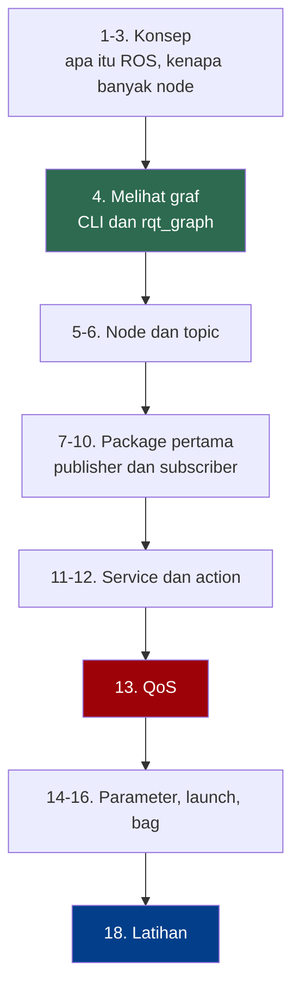

Bagian 4 dan 13 yang paling sering menyelamatkan kalian saat macet. Bagian 18 yang dinilai.

## 1. Apa itu ROS, dan apa yang bukan

Nama ROS adalah singkatan dari Robot Operating System, dan nama itu menyesatkan. ROS bukan sistem operasi. ROS berjalan di atas Linux.

| Yang kalian dapat | Wujudnya | Gunanya |
|---|---|---|
| Middleware publish-subscribe | DDS di lapisan bawah | Program kecil saling berkirim pesan tanpa tahu lawan bicaranya |
| Sistem build dan konvensi paket | `colcon`, `ament` | Kode dari ribuan orang bisa dipasang berdampingan tanpa saling merusak |
| Kesepakatan bersama | REP, tipe pesan standar | Nama frame, satuan, tata nama topic seragam lintas pembuat |

Kesepakatan di baris ketiga yang membuat driver lidar buatan orang Jerman bisa langsung dipakai algoritma navigasi buatan orang Jepang.

Yang tidak diberikan ROS: ROS tidak membuat robot kalian pintar, tidak menyediakan algoritma, dan tidak menjamin apa pun soal waktu. ROS adalah pipa dan konvensi. Isi pipanya kalian yang tentukan.

## 2. Kenapa robot dibangun dari banyak program kecil

Robot paling sederhana pun mengerjakan beberapa hal sekaligus, dan masing-masing punya kecepatan sendiri.

| Bagian | Kecepatan wajar | Kalau terlambat |
|---|---|---|
| Loop kendali motor | 100 Hz | Robot oleng atau bergetar |
| Lidar | 10 Hz | Rintangan terlihat terlambat |
| Kamera | 30 Hz | Frame basi, tidak berguna |
| Path planner | 0.5 Hz, kadang lebih lambat | Tidak apa-apa, asal yang lain jalan terus |
| Rem darurat | secepat mungkin | Fatal |

Kalian bisa saja menulis semuanya dalam satu program dengan satu loop besar. Untuk tugas pertama itu bahkan lebih mudah. Masalahnya, loop tersebut akan berjalan pada kecepatan komponen paling lambat. Robot kalian menabrak dinding sambil menunggu path planner selesai berpikir.

Masalah kedua, kalau satu bagian crash, seluruh robot mati. Padahal path planner yang crash masih bisa ditoleransi, sedangkan rem darurat tidak.

Karena itu robot dibangun sebagai kumpulan program kecil yang berjalan sendiri-sendiri, masing-masing dengan kecepatannya sendiri, saling berkirim pesan. Di ROS, program kecil itu disebut node.

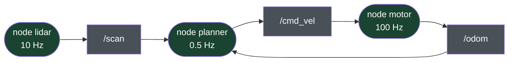

Kotak lonjong adalah node, kotak persegi adalah topic. Perhatikan bahwa node planner yang lambat tidak memperlambat node motor yang cepat. Masing-masing berjalan sendiri.

## 3. Pergeseran cara berpikir yang paling penting

Ini bagian yang paling sering membuat mahasiswa dengan latar belakang pemrograman tersandung, jadi baca pelan-pelan.

| | Program biasa | Sistem ROS |
|---|---|---|
| Programnya apa | kode yang kalian tulis | graf node yang sedang berjalan |
| Titik masuk | satu, `main` | banyak, satu per node |
| Alur eksekusi | call stack yang bisa ditelusuri | tidak ada call stack lintas node |
| Urutan startup | ditentukan kode | tidak dijamin, bisa berbeda tiap kali |
| Cara debug | pasang breakpoint | periksa graf dari luar |
| Bug tersering | logika salah | nama topic salah, tipe beda, QoS bentrok |

Node bisa sempurna secara internal dan sistemnya tetap tidak jalan, karena node itu mengirim ke `/cmd_vel` sementara yang lain mendengarkan `/robot/cmd_vel`.

Karena itu materi ini mengajarkan alat inspeksi lebih dulu, sebelum mengajarkan cara menulis node. Di ROS, kemampuan melihat isi graf yang sedang berjalan lebih berharga daripada kemampuan menulis kode node.

## 4. Melihat graf yang sedang berjalan

Jalankan simulator kura-kura bawaan ROS. Kalian akan butuh tiga terminal.

```
┌─────────────────────────┬─────────────────────────┐
│ Terminal 1              │ Terminal 2              │
│                         │                         │
│ ros2 run turtlesim \    │ ros2 run turtlesim \    │
│   turtlesim_node        │   turtle_teleop_key     │
│                         │                         │
│ jendela kura-kura       │ klik di sini,           │
│ muncul                  │ tekan tombol panah      │
├─────────────────────────┴─────────────────────────┤
│ Terminal 3                                        │
│                                                   │
│ semua perintah inspeksi di bawah dijalankan       │
│ dari sini                                         │
└───────────────────────────────────────────────────┘
```

Terminal 1:

```bash
ros2 run turtlesim turtlesim_node
```

Terminal 2:

```bash
ros2 run turtlesim turtle_teleop_key
```

Klik terminal 2, lalu tekan tombol panah. Kura-kuranya bergerak. Kalian baru saja menjalankan graf berisi dua node yang saling berkirim pesan lewat topic dan service:

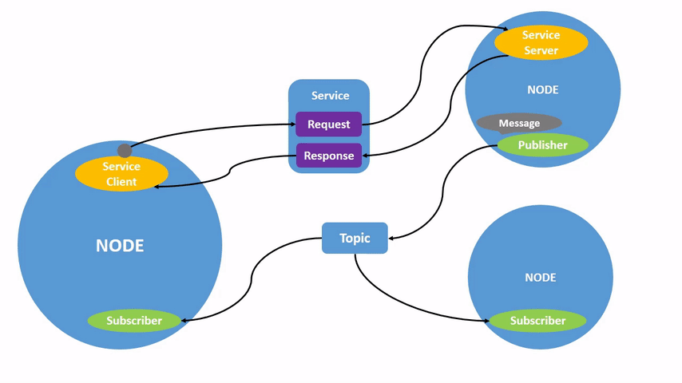

### Tujuh perintah yang wajib hafal

Semua dijalankan dari terminal 3.

| Perintah | Menjawab pertanyaan |
|---|---|
| `ros2 node list` | Node apa saja yang hidup sekarang |
| `ros2 topic list` | Topic apa saja yang ada |
| `ros2 topic info /nama --verbose` | Siapa mengirim, siapa menerima, QoS-nya apa |
| `ros2 topic echo /nama` | Isi pesannya apa, secara langsung |
| `ros2 topic hz /nama` | Seberapa sering pesannya datang |
| `ros2 interface show tipe/msg/Nama` | Bentuk tipe pesannya seperti apa |
| `ros2 topic pub` | Kirim pesan manual tanpa menulis kode |

Coba satu per satu:

```bash
ros2 node list
ros2 topic list
ros2 topic info /turtle1/cmd_vel --verbose
ros2 topic echo /turtle1/cmd_vel
```

Perintah `echo` akan diam sampai kalian menekan tombol panah lagi di terminal 2. Coba tekan, dan perhatikan isinya muncul.

```bash
ros2 topic hz /turtle1/pose
ros2 interface show geometry_msgs/msg/Twist
```

Terakhir, kirim pesan langsung dari terminal, tanpa menulis kode sama sekali:

```bash
ros2 topic pub --once /turtle1/cmd_vel geometry_msgs/msg/Twist "{linear: {x: 2.0}, angular: {z: 1.0}}"
```

Kura-kuranya bergerak melengkung. Node teleop tidak tahu-menahu, dan node turtlesim juga tidak peduli pesan itu datang dari mana.

### Melihat grafnya sebagai gambar

ROS bisa menggambar sendiri graf yang sedang berjalan:

```bash
rqt_graph
```

Sebuah jendela terbuka dan menampilkan node beserta koneksinya:

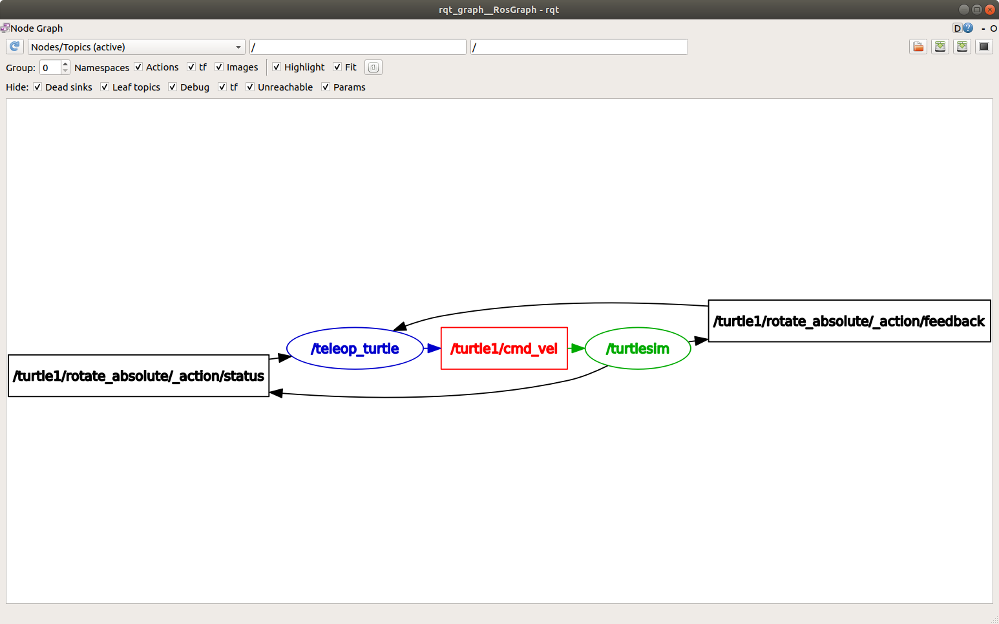

Secara bawaan sebagian elemen disembunyikan. Pilih `Nodes/Topics (all)` di kiri atas supaya topic ikut terlihat:

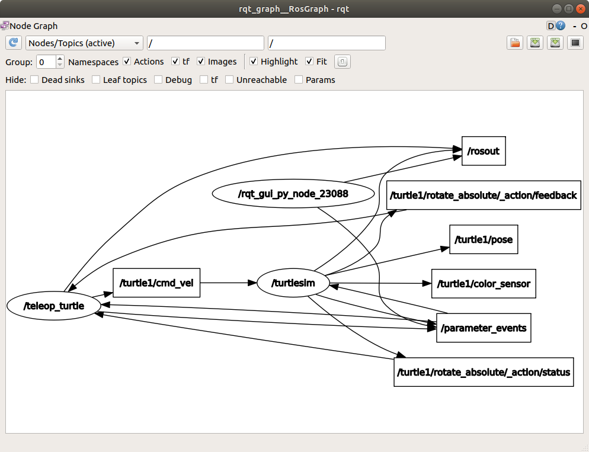

Lalu matikan centang `Debug` supaya tampilannya bersih:

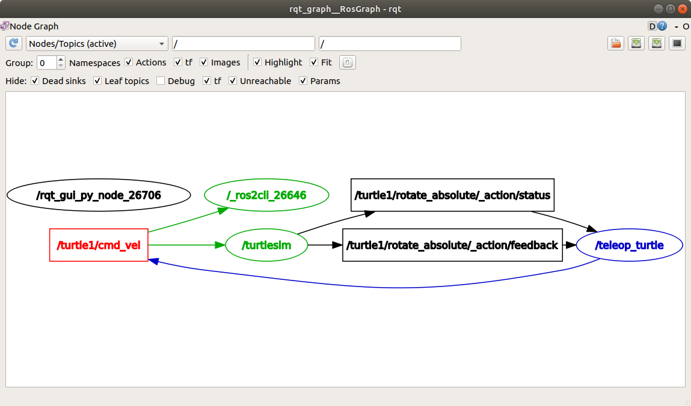

Biasakan membuka `rqt_graph` setiap kali sistem kalian tidak berperilaku sesuai harapan. Dua node yang seharusnya tersambung tapi tergambar terpisah adalah petunjuk paling cepat yang bisa kalian dapat.

Sebagian besar sesi debugging di kelas ini berakhir di salah satu dari tujuh perintah tabel di atas, atau di `rqt_graph`.

## 5. Node

Node adalah satu program yang ikut dalam graf. Satu node biasanya bertanggung jawab atas satu hal: membaca satu sensor, mengendalikan satu aktuator, menjalankan satu algoritma.

Node punya nama, dan nama itu harus unik dalam graf. Kalau dua node punya nama sama, keduanya tetap jalan tapi perilakunya jadi membingungkan.

Node bukan proses. Satu proses bisa memuat beberapa node. Untuk sekarang anggap saja satu node sama dengan satu proses, karena itu yang akan kalian tulis.

## 6. Topic

Topic adalah kanal bernama yang dilalui aliran pesan. Sifatnya satu arah dan anonim.

Bentuk paling sederhana, satu publisher ke satu subscriber:


Tapi jumlahnya tidak dibatasi. Satu topic bisa punya banyak publisher dan banyak subscriber sekaligus:

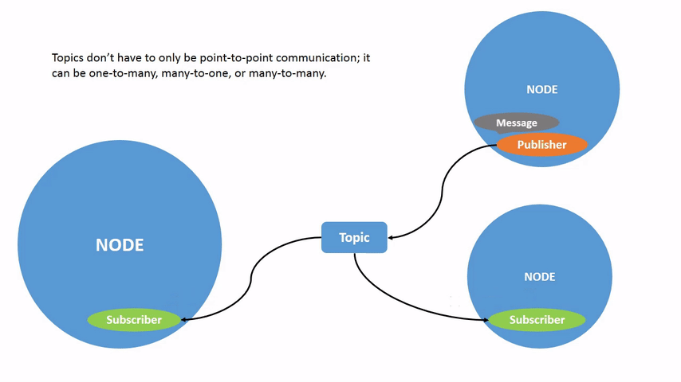

Publisher tidak tahu siapa yang mendengarkan. Subscriber tidak tahu siapa yang mengirim. Bisa ada nol publisher, bisa banyak. Bisa ada nol subscriber, bisa banyak.

Sifat anonim ini sengaja, dan konsekuensinya besar. Kalian bisa menyisipkan node perekam pada topic mana pun tanpa mengubah satu baris kode pun di node yang sudah ada. Kalian juga bisa mengganti driver lidar asli dengan lidar simulasi, dan sisa sistem tidak menyadarinya.

Topic dipakai untuk data yang mengalir terus: bacaan sensor, perintah kecepatan, estimasi posisi. Kalau pertanyaannya "berapa nilainya sekarang", jawabannya topic.

Setiap topic punya satu tipe pesan, dan tipe itu tidak boleh berubah. Publisher yang mengirim tipe berbeda ke topic yang sama tidak akan tersambung.

## 7. Workspace dan package

Sebelum menulis node, kalian butuh tempat menaruhnya. Kode ROS hidup di dalam package, dan package hidup di dalam workspace.

```bash
mkdir -p ~/ros2_ws/src
cd ~/ros2_ws/src
ros2 pkg create --build-type ament_python --license Apache-2.0 latihan_ros
```

Hasilnya:

```
ros2_ws/                      workspace, tempat kalian menjalankan colcon build
├── src/                      satu-satunya folder yang kalian tulis sendiri
│   └── latihan_ros/          package
│       ├── package.xml       metadata dan dependensi
│       ├── setup.py          daftar program yang bisa dijalankan
│       ├── setup.cfg
│       ├── resource/
│       └── latihan_ros/      kode Python kalian di sini
│           └── __init__.py
├── build/                    dibuat colcon, jangan disentuh
├── install/                  dibuat colcon, di sini setup.bash berada
└── log/                      dibuat colcon, berguna saat build gagal
```

Dua file yang akan sering kalian sentuh adalah `package.xml`, tempat mendaftarkan dependensi, dan `setup.py`, tempat mendaftarkan program yang bisa dijalankan.

## 8. Node pertama: publisher

Buat file `~/ros2_ws/src/latihan_ros/latihan_ros/talker.py`:

```python
import rclpy
from rclpy.node import Node
from std_msgs.msg import String


class Talker(Node):
    def __init__(self):
        super().__init__('talker')
        self.pub = self.create_publisher(String, 'chatter', 10)
        self.timer = self.create_timer(0.5, self.timer_callback)
        self.count = 0

    def timer_callback(self):
        msg = String()
        msg.data = f'halo {self.count}'
        self.pub.publish(msg)
        self.get_logger().info(f'mengirim: {msg.data}')
        self.count += 1


def main():
    rclpy.init()
    node = Talker()
    rclpy.spin(node)
    node.destroy_node()
    rclpy.shutdown()


if __name__ == '__main__':
    main()
```

| Baris | Kenapa begitu |
|---|---|
| `create_publisher(String, 'chatter', 10)` | Angka 10 adalah queue depth, bagian dari QoS. Lihat bagian 13 |
| `create_timer(0.5, self.timer_callback)` | Jangan pernah pakai `while True` dengan `sleep` di dalam node. Timer yang mengatur ritme |
| `rclpy.spin(node)` | Menyerahkan kendali ke ROS. Tidak kembali sampai node dimatikan. Semua pekerjaan terjadi di dalam callback |
| `self.get_logger().info(...)` | Bukan `print()`. Log ini punya stempel waktu, punya level, bisa disaring, dan ikut terlihat saat dijalankan lewat launch file |

## 9. Node kedua: subscriber

Buat file `~/ros2_ws/src/latihan_ros/latihan_ros/listener.py`:

```python
import rclpy
from rclpy.node import Node
from std_msgs.msg import String


class Listener(Node):
    def __init__(self):
        super().__init__('listener')
        self.sub = self.create_subscription(String, 'chatter', self.listener_callback, 10)

    def listener_callback(self, msg):
        self.get_logger().info(f'menerima: {msg.data}')


def main():
    rclpy.init()
    node = Listener()
    rclpy.spin(node)
    node.destroy_node()
    rclpy.shutdown()


if __name__ == '__main__':
    main()
```

Perhatikan bahwa subscriber tidak pernah menyebut node publisher. Yang disebut cuma nama topic dan tipe pesannya. Itulah yang dimaksud anonim di bagian 6.

## 10. Mendaftarkan dan membangun

Buka `setup.py`, cari bagian `entry_points`, isi seperti ini:

```python
    entry_points={
        'console_scripts': [
            'talker = latihan_ros.talker:main',
            'listener = latihan_ros.listener:main',
        ],
    },
```

Buka `package.xml`, tambahkan di bawah baris `<buildtool_depend>`:

```xml
  <depend>rclpy</depend>
  <depend>std_msgs</depend>
```

Build dari akar workspace, bukan dari dalam folder package:

```bash
cd ~/ros2_ws
colcon build
source install/setup.bash
```

### Dua setup script yang berbeda

Ini sumber kebingungan yang paling sering muncul di minggu pertama.

| Script | Isinya | Kapan dijalankan |
|---|---|---|
| `/opt/ros/jazzy/setup.bash` | ROS itu sendiri | Otomatis, sudah ada di `~/.bashrc` |
| `~/ros2_ws/install/setup.bash` | Package buatan kalian | Manual, di setiap terminal baru, setiap kali |

Yang kedua sering terlupakan. Gejalanya `Package 'latihan_ros' not found` padahal build barusan sukses.

Sekarang jalankan.

```
┌──────────────────────────────┬──────────────────────────────┐
│ Terminal 1                   │ Terminal 2                   │
│                              │                              │
│ cd ~/ros2_ws                 │ cd ~/ros2_ws                 │
│ source install/setup.bash    │ source install/setup.bash    │
│ ros2 run latihan_ros \       │ ros2 run latihan_ros \       │
│   talker                     │   listener                   │
│                              │                              │
│ mengirim: halo 0             │ menerima: halo 0             │
│ mengirim: halo 1             │ menerima: halo 1             │
├──────────────────────────────┴──────────────────────────────┤
│ Terminal 3                                                  │
│ ros2 topic echo /chatter                                    │
│ ros2 topic hz /chatter                                      │
│ ros2 node info /talker                                      │
│ rqt_graph                                                   │
└─────────────────────────────────────────────────────────────┘
```

Kalau listener diam saja, jangan langsung membaca ulang kode kalian. Jalankan `ros2 topic list` dan `ros2 topic info /chatter --verbose` lebih dulu, atau buka `rqt_graph`. Sembilan dari sepuluh kali jawabannya kelihatan di situ.

## 11. Service

Topic cocok untuk data yang mengalir. Sebagian hal tidak berbentuk aliran, melainkan permintaan yang butuh jawaban. Contohnya: reset odometri, nyalakan lampu, hitung nilai ini.

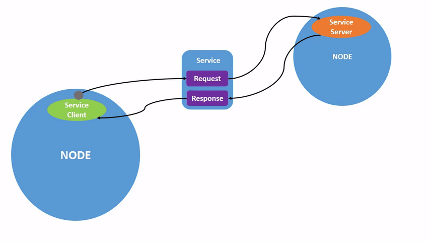

Satu server bisa melayani banyak klien, tapi setiap pasangan tetap berbentuk satu permintaan dan satu jawaban:

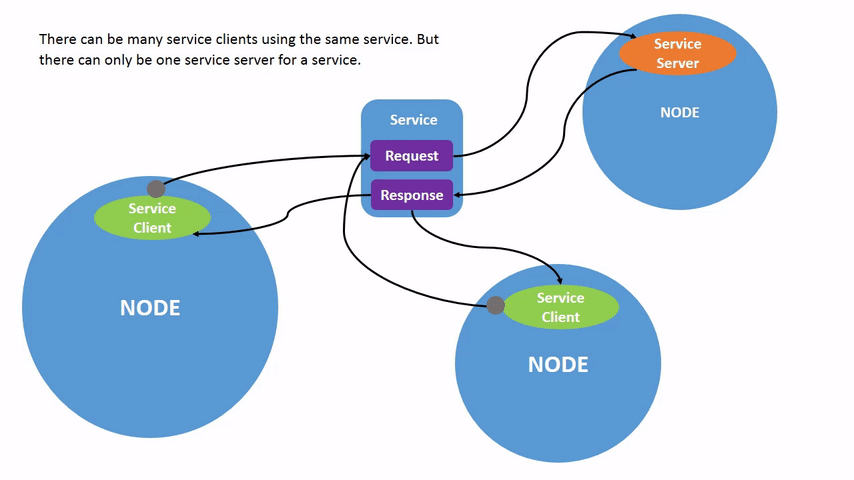

Coba dengan turtlesim yang masih berjalan:

```bash
ros2 service list
ros2 service type /spawn
ros2 interface show turtlesim/srv/Spawn
ros2 service call /spawn turtlesim/srv/Spawn "{x: 2.0, y: 2.0, theta: 0.0, name: 'kura2'}"
```

Kura-kura kedua muncul.

Satu peringatan penting. Jangan memanggil service dari dalam callback lalu menunggu hasilnya secara sinkron. Node kalian akan macet, karena thread yang seharusnya memproses balasan sedang kalian tahan di dalam callback. Gejalanya membingungkan, yaitu program menggantung tanpa pesan error apa pun. Kalau perlu memanggil service dari callback, pakai `call_async` dan tangani hasilnya lewat future.

## 12. Action

Service punya kelemahan: pemanggil menunggu tanpa kabar. Kalau permintaannya "jalan ke koordinat itu" dan butuh 30 detik, pola permintaan-balasan tidak memadai. Kalian butuh feedback, dan kalian butuh kemampuan membatalkan.

Perhatikan tiga aliran terpisah pada gambar berikut: goal yang dikirim sekali, feedback yang mengalir terus selama pengerjaan, dan result di akhir.

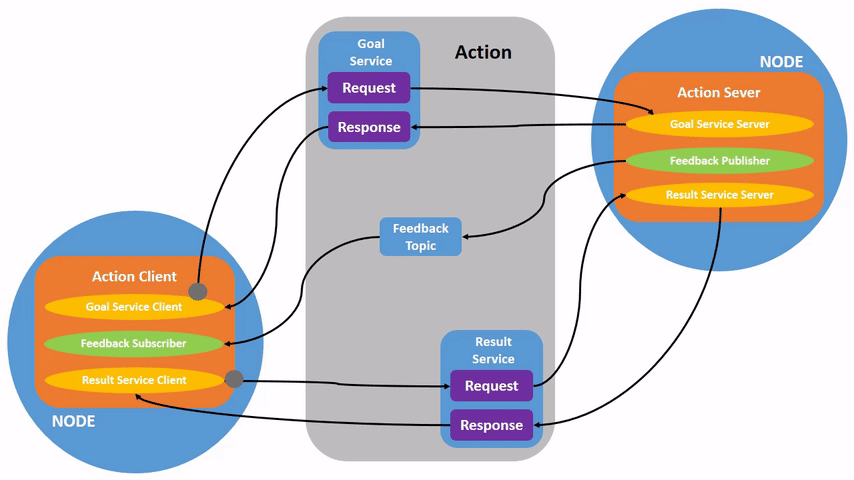

Turtlesim punya satu action. Coba:

```bash
ros2 action list
ros2 action info /turtle1/rotate_absolute
ros2 interface show turtlesim/action/RotateAbsolute
ros2 action send_goal --feedback /turtle1/rotate_absolute turtlesim/action/RotateAbsolute "{theta: 3.14}"
```

Perhatikan aliran feedback yang muncul selama kura-kura berputar. Itu yang tidak bisa diberikan service.

### Memilih di antara ketiganya

| | Topic | Service | Action |
|---|---|---|---|
| Arah | satu arah | bolak-balik | bolak-balik, berkali-kali |
| Pemanggil menunggu | tidak | ya | tidak, tapi dapat kabar |
| Bisa dibatalkan | tidak relevan | tidak | ya |
| Feedback | tidak | tidak | ya |
| Cocok untuk | data mengalir terus | permintaan cepat | tugas panjang |
| Contoh | `/scan`, `/cmd_vel`, `/odom` | reset odometri, spawn objek | navigasi ke titik, angkat lengan |

Kalian akan banyak memakai action nanti saat masuk ke navigasi. Perintah "pergi ke titik ini" di Nav2 adalah sebuah action.

## 13. QoS

Bagian ini sering dilewati mahasiswa, lalu menghabiskan satu sesi lab karena topic yang kelihatannya benar tapi tidak menyambung.

QoS singkatan dari Quality of Service, yaitu sekumpulan pengaturan yang menentukan bagaimana pesan dikirim. Publisher punya pengaturan QoS, subscriber juga. Kalau keduanya tidak kompatibel, koneksinya tidak terbentuk sama sekali. Tidak ada pesan error. Topic tetap muncul di `ros2 topic list`, dan data tidak pernah sampai.

### Tiga pengaturan yang perlu dikenal sekarang

| Pengaturan | Pilihan | Artinya | Dipakai untuk |
|---|---|---|---|
| Reliability | `RELIABLE` | Pesan dikirim ulang sampai sampai | Perintah kecepatan, hal yang tidak boleh hilang |
| | `BEST_EFFORT` | Pesan hilang ya sudah | Kamera resolusi tinggi, frame basi tidak berguna |
| Durability | `VOLATILE` | Subscriber baru tidak dapat apa-apa sampai pesan berikutnya | Data yang terus mengalir |
| | `TRANSIENT_LOCAL` | Publisher menyimpan pesan terakhir, langsung dikirim ke subscriber baru | Peta, data yang jarang berubah |
| Depth | angka | Berapa pesan ditahan di antrean | Ini angka `10` di kode kalian |

### Matriks kompatibilitas

Subscriber tidak boleh menuntut jaminan yang lebih ketat daripada yang ditawarkan publisher.

| Publisher | Subscriber | Tersambung |
|---|---|---|
| `RELIABLE` | `RELIABLE` | ya |
| `RELIABLE` | `BEST_EFFORT` | ya |
| `BEST_EFFORT` | `BEST_EFFORT` | ya |
| `BEST_EFFORT` | `RELIABLE` | **tidak** |
| `TRANSIENT_LOCAL` | `VOLATILE` | ya |
| `VOLATILE` | `TRANSIENT_LOCAL` | **tidak** |

Dua baris bertanda tebal itu yang akan memakan waktu kalian. Cara memeriksanya:

```bash
ros2 topic info /nama_topic --verbose
```

Perintah itu menampilkan profil QoS kedua sisi. Bandingkan. Kalau publisher dan subscriber sama-sama ada tapi data tidak mengalir, di sinilah jawabannya.

## 14. Parameter

Nilai yang mungkin ingin kalian ubah tanpa mengubah kode sebaiknya jadi parameter. Contohnya kecepatan maksimum, nama frame, nama port serial.

Deklarasikan di dalam konstruktor node:

```python
self.declare_parameter('max_speed', 1.0)
```

Bacanya:

```python
kecepatan = self.get_parameter('max_speed').value
```

Dari terminal:

```bash
ros2 param list
ros2 param get /nama_node max_speed
ros2 param set /nama_node max_speed 2.5
```

Nilai yang di-hardcode akan menyulitkan kalian sendiri nanti, terutama saat pindah dari simulasi ke robot nyata. Angka yang berbeda antara simulasi dan perangkat keras sebaiknya jadi parameter sejak awal.

## 15. Launch file

Setelah sistem kalian berisi lima node, menjalankannya satu per satu di lima terminal jadi menyiksa.

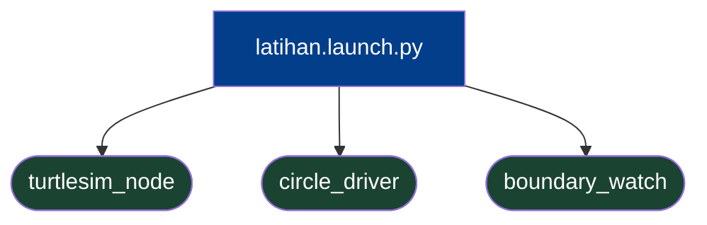

Buat folder `launch` di dalam package, lalu file `latihan.launch.py`:

```python
from launch import LaunchDescription
from launch_ros.actions import Node


def generate_launch_description():
    return LaunchDescription([
        Node(
            package='latihan_ros',
            executable='talker',
            name='talker',
        ),
        Node(
            package='latihan_ros',
            executable='listener',
            name='listener',
        ),
    ])
```

Supaya file ini ikut terpasang, tambahkan ke `data_files` di `setup.py`:

```python
import os
from glob import glob

    data_files=[
        ('share/ament_index/resource_index/packages', ['resource/' + package_name]),
        ('share/' + package_name, ['package.xml']),
        (os.path.join('share', package_name, 'launch'), glob('launch/*.launch.py')),
    ],
```

Build ulang, source, jalankan:

```bash
cd ~/ros2_ws && colcon build && source install/setup.bash
ros2 launch latihan_ros latihan.launch.py
```

Launch file bisa jauh lebih pintar dari contoh ini. Bisa menerima argumen, memuat file parameter, mengganti nama topic, dan memanggil launch file lain. Untuk sekarang cukup tahu bahwa file ini yang akan kalian pakai untuk menyalakan seluruh robot.

## 16. Merekam dan memutar ulang

Karena semua yang penting lewat topic, seluruhnya bisa direkam.

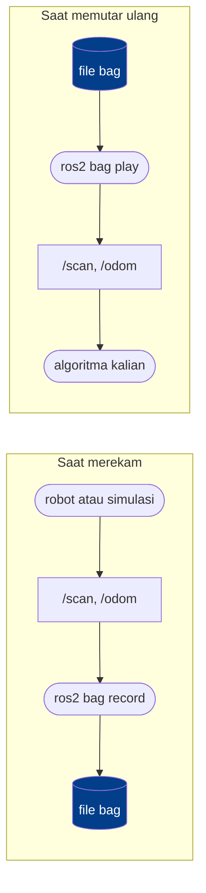

```bash
ros2 bag record -o rekaman1 /chatter
```

Hentikan dengan Ctrl-C. Lalu:

```bash
ros2 bag info rekaman1
ros2 bag play rekaman1
```

Saat diputar ulang, node lain tidak bisa membedakan data rekaman dengan data asli. Kalian bisa merekam sekali dari robot nyata, lalu mengembangkan algoritma di meja kerja dengan data yang sama persis berulang kali.

Tugas mingguan di kelas ini dikumpulkan dalam bentuk bag. Sistem penilaian memutar ulang rekaman kalian dan memeriksa topic serta isinya. Karena itu, apa pun sistem operasi yang kalian pakai, penilaiannya sama.

## 17. Kesalahan yang paling sering terjadi

| Gejala | Penyebab | Solusi |
|---|---|---|
| `Package 'latihan_ros' not found` padahal build sukses | Lupa source `install/setup.bash` di terminal baru | `cd ~/ros2_ws && source install/setup.bash` |
| Build aneh, hasil tidak berubah | `colcon build` dijalankan dari dalam folder package | Selalu build dari `~/ros2_ws` |
| Build sukses, `ros2 run` tidak menemukan program | Lupa mendaftarkan di `entry_points` | Isi `setup.py`, build ulang |
| Node hidup, topic ada, data tidak mengalir | QoS tidak kompatibel | `ros2 topic info --verbose`, bandingkan kedua sisi |
| Node saling tidak melihat sama sekali | `ROS_DOMAIN_ID` berbeda antar terminal | `echo $ROS_DOMAIN_ID` di semua terminal, samakan |
| Topic tersambung di satu tempat, tidak di tempat lain | Beda `chatter` dan `/chatter`. Yang pertama relatif terhadap namespace, kedua absolut | Perhatikan garis miring di depan |
| Output tidak muncul saat pakai launch file | Memakai `print()` | Ganti dengan `self.get_logger().info()` |
| Seluruh node macet | Callback menahan eksekusi terlalu lama, atau memanggil service secara sinkron dari dalam callback | Pindahkan kerja berat ke node lain, pakai `call_async` |

## 18. Latihan

Kerjakan berurutan. Setiap nomor memakai hasil nomor sebelumnya.

| No | Tugas | Yang dilatih | Bukti |
|---|---|---|---|
| 1 | Ubah `talker` supaya periodenya diambil dari parameter `period`, bawaan 0.5 | Parameter | `ros2 param set` mengubah hasil `ros2 topic hz` |
| 2 | Tulis node `circle_driver` yang mengirim `geometry_msgs/msg/Twist` ke `/turtle1/cmd_vel` sehingga kura-kura bergerak melingkar | Publisher ke topic milik orang lain | Kura-kura berputar |
| 3 | Tulis node `boundary_watch` yang mendengarkan `/turtle1/pose` dan memperingatkan saat kura-kura kurang dari 1 satuan dari tepi. Arena berukuran 11 kali 11 | Subscriber dan logika | Peringatan muncul di tepi |
| 4 | Buat launch file yang menjalankan `turtlesim_node`, `circle_driver`, dan `boundary_watch` sekaligus | Launch | Satu perintah, tiga node hidup di `rqt_graph` |
| 5 | Rekam 20 detik `/turtle1/pose` dan `/turtle1/cmd_vel`. Matikan semuanya. Putar ulang bag sambil menjalankan `boundary_watch` saja | Perekaman dan arsitektur | `boundary_watch` mencetak peringatan yang sama |

Nomor kelima adalah intinya. Node `boundary_watch` tidak bisa membedakan apakah data datang dari simulasi yang hidup atau dari file rekaman, dan itu bukan kebetulan. Kalau berhasil, kalian sudah paham kenapa arsitektur ROS berbentuk seperti itu.

## Bacaan lanjutan

Materi ini adalah ringkasan yang disusun untuk urutan perkuliahan kita. Penjelasan resmi yang lebih panjang ada di dokumentasi ROS 2, dan berguna kalau kalian ingin menggali satu topik lebih dalam.

| Topik | Halaman resmi |
|---|---|
| Node | [Understanding nodes](https://docs.ros.org/en/jazzy/Tutorials/Beginner-CLI-Tools/Understanding-ROS2-Nodes/Understanding-ROS2-Nodes.html) |
| Topic | [Understanding topics](https://docs.ros.org/en/jazzy/Tutorials/Beginner-CLI-Tools/Understanding-ROS2-Topics/Understanding-ROS2-Topics.html) |
| Service | [Understanding services](https://docs.ros.org/en/jazzy/Tutorials/Beginner-CLI-Tools/Understanding-ROS2-Services/Understanding-ROS2-Services.html) |
| Action | [Understanding actions](https://docs.ros.org/en/jazzy/Tutorials/Beginner-CLI-Tools/Understanding-ROS2-Actions/Understanding-ROS2-Actions.html) |
| Parameter | [Understanding parameters](https://docs.ros.org/en/jazzy/Tutorials/Beginner-CLI-Tools/Understanding-ROS2-Parameters/Understanding-ROS2-Parameters.html) |
| QoS | [About Quality of Service settings](https://docs.ros.org/en/jazzy/Concepts/Intermediate/About-Quality-of-Service-Settings.html) |
| Bag | [Recording and playing back data](https://docs.ros.org/en/jazzy/Tutorials/Beginner-CLI-Tools/Recording-And-Playing-Back-Data/Recording-And-Playing-Back-Data.html) |

## Catatan teknis dan atribusi

Animasi dan screenshot di bagian 4, 6, 11, dan 12 diambil dari dokumentasi resmi ROS 2, filenya tersimpan di folder `media/ros2-docs/`. Sumbernya adalah repositori [ros2/ros2_documentation](https://github.com/ros2/ros2_documentation) cabang `jazzy`, di bawah lisensi [Creative Commons Attribution 4.0 International](https://creativecommons.org/licenses/by/4.0/). Filenya kami salin apa adanya tanpa modifikasi.

File disalin ke folder lokal, bukan ditautkan langsung ke internet, supaya materi tetap tampil utuh saat jaringan lab dibatasi.

Diagram selebihnya, yaitu peta materi di awal, diagram beda kecepatan node di bagian 2, diagram launch file di bagian 15, dan diagram bag di bagian 16, ditulis dengan sintaks mermaid dan khusus dibuat untuk mata kuliah ini. Diagram mermaid tampil sebagai gambar kalau file dibuka lewat GitHub, GitLab, Obsidian, atau pratinjau markdown di VS Code. Di penampil markdown sederhana, isinya tampil sebagai teks dan masih terbaca.
